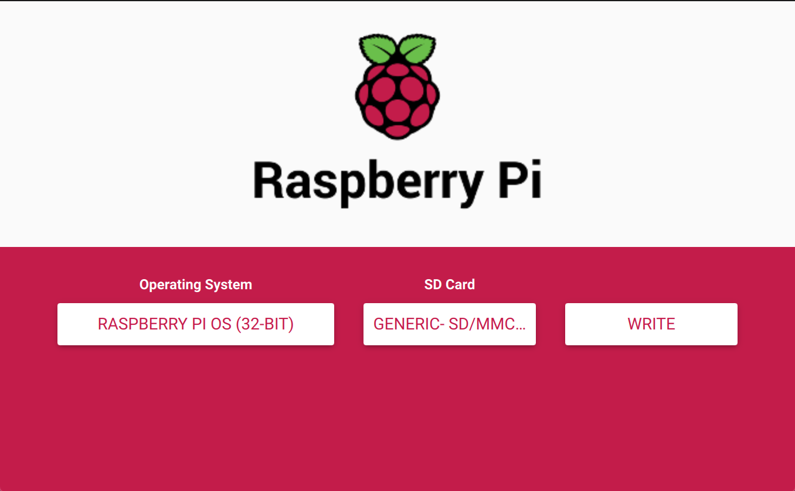

Late last year I finally got my hands on a Raspberry Pi 4.

Didn't have any specific plans since [the Pi 3](https://rendered-obsolete.github.io/2019/03/21/raspi_3.html) is [suitable](https://rendered-obsolete.github.io/2019/03/25/pi3_pm25.html) for [my projects](https://rendered-obsolete.github.io/2020/01/02/rhasspy.html).  But, I was curious how it stacked up against the rest of the Pi family (from [Wikipedia](https://en.wikipedia.org/wiki/Raspberry_Pi#Specifications)):

Model | CPU | GPU | Memory | Interfaces
|-|-|-|-|-
RPi Zero W | 1× ARM1176JZF-S @ 1 GHz | Broadcom VideoCore IV @ 250 MHz | 512 MB | HDMI, micro-USB 2.0, Wifi b/g/n single band @ 2.4 GHz, BT 4.1 BLE
RPi 3 B | 4x Cortex-A53 @ 1.2 GHz | Broadcom VideoCore IV @ 250 MHz | 1 GB | HDMI v1.3, USB 2.0, 100 Mbit ethernet, Wifi b/g/n single band @ 2.4 GHz, BT 4.1 BLE
RPi 4 B | 4x Cortex-A72 @ 1.5 GHz | Broadcom VideoCore VI @ 500 MHz | 2/4/8 GB | micro-HDMI v2.0, USB 3.0 (type C), 1000 Mbit ethernet, Wifi b/g/n/ac dual band @ 2.4/5 GHz, BT 5.0

## Setup

Usually, I do manual [installation](https://rendered-obsolete.github.io/2019/03/28/raspi_zero.html#setup), but there's a new installation helper, [Raspberry Pi Imager](https://www.raspberrypi.org/software/):



Attach a screen/keyboard/mouse or continue with 
[headless setup](https://rendered-obsolete.github.io/2019/03/21/raspi_3.html#initial-shell-access) by creating two files on the SD card.  You can also go the [OTG Ethernet gadget](https://rendered-obsolete.github.io/2019/03/28/raspi_zero.html#setup) route to power, connect to the pi4, and give it network access all through its USB-C.

Create [`wpa_supplicant.conf` file in root of the boot partition](https://www.raspberrypi.org/documentation/configuration/wireless/headless.md):
```
ctrl_interface=DIR=/var/run/wpa_supplicant GROUP=netdev
update_config=1
country=<Insert 2 letter ISO 3166-1 country code here>

network={
 ssid="<Name of your wireless LAN>"
 psk="<Password for your wireless LAN>"
}
```

Where the value of `country` is "Alpha-2 code" from
[this Wikipedia table](https://en.wikipedia.org/wiki/ISO_3166-1#Current_codes).

Enable remote SSH by creating [an empty `ssh` file in the same place](https://www.raspberrypi.org/documentation/remote-access/ssh/README.md).

Alternatively, you can use `Cmd+Shift+X` to pre-configure the OS per [the official video](https://www.youtube.com/watch?v=ntaXWS8Lk34).

Power on, check your wifi AP for the IP address, and `ssh pi@IP_ADDRESS` (default password is "raspberry").

## Benchmarks

Next, install and run [Phoronix Test Suite](https://www.phoronix-test-suite.com/) to compare against our [previous results](https://rendered-obsolete.github.io/2019/04/01/jetson_nano.html#benchmarks):

```
wget http://phoronix-test-suite.com/releases/repo/pts.debian/files/phoronix-test-suite_10.2.0_all.deb
sudo dpkg -i phoronix-test-suite_10.2.0_all.deb
phoronix-test-suite benchmark 1809111-RA-ARMLINUX005
```

|Test | Pi Zero | Pi 3 B | Pi 4 B (8GB) | Nano | TX1 | Notes
|-|-|-|-|-|-|-
| Tinymembench (memcpy) | 291 | 1297 | 2729 | 3504 | 3862
| TTSIOD 3D Renderer | | 15.66 | | 40.83 | 45.05
| 7-Zip Compression | 205 | 1863 | 3631 | 3996 | 4526
| C-Ray | | 2357 | 732 | 943 | 851 | Seconds (lower is better)
| Primesieve | | 1543 | 580 | 466 | 401 | Seconds (lower is better)
| AOBench | 778 | 333 | 123 | 190 | 165 | Seconds (lower is better)
| FLAC Audio Encoding | 971.18 | 387.09 | 102.02 | 103.57 | 78.86 | Seconds (lower is better)
| LAME MP3 Encoding | 780 | 352.66 | 124.98 | 143.82 | 113.14 | Seconds (lower is better)
| Perl (Pod2html) | 5.3830| 1.2945 | 0.6291 | 0.7154 | 0.6007 | Seconds (lower is better)
| PostgreSQL (Read Only) | | 6640 | 10455 | 12410 | 16079
| Redis (GET) | 34567 | 213067 | | 568431 | 484688
| PyBench | 76419 | 24349 | 5263 | 7030 | 6348 | ms (lower is better)
| Scikit-Learn | | 844 | | 496 | 434 | Seconds (lower is better)

The Raspberry Pi 4 w/ 8 GB is in roughly the same performance class as the $99 Nvidia Jetson Nano.  Although the comparison is a bit apples-to-oranges since the Nano only has 4 GB of memory.

## Software

Install Rust via rustup:
```
curl --proto '=https' --tlsv1.2 -sSf https://sh.rustup.rs | sh
```

[.NET 5.0 for Debian](https://docs.microsoft.com/en-us/dotnet/core/install/linux-debian).  Apt installation doesn't currently work, but both `dotnet-install` script (including [dependencies](https://docs.microsoft.com/en-us/dotnet/core/install/linux-debian#dependencies)) and [Snap](https://docs.microsoft.com/en-us/dotnet/core/install/linux-snap) work:
```bash
# dotnet-install
sudo apt-get install -y libc6 libgcc1 libgssapi-krb5-2 libicu63 libssl1.1 libstdc++6 zlib1g
curl -sSL https://dot.net/v1/dotnet-install.sh | bash /dev/stdin --channel Current
# OR, Snap
sudo apt install snapd
sudo snap install --edge dotnet-sdk --classic
```

https://docs.microsoft.com/en-us/powershell/scripting/install/installing-powershell-core-on-linux#debian-10
With dotnet, it's easy to install [PowerShell as a gloal tool](https://docs.microsoft.com/en-us/powershell/scripting/install/installing-powershell-core-on-linux#install-as-a-net-global-tool)
https://docs.microsoft.com/en-us/powershell/scripting/install/installing-powershell-core-on-linux#raspbian
```
dotnet tool install --global PowerShell
```