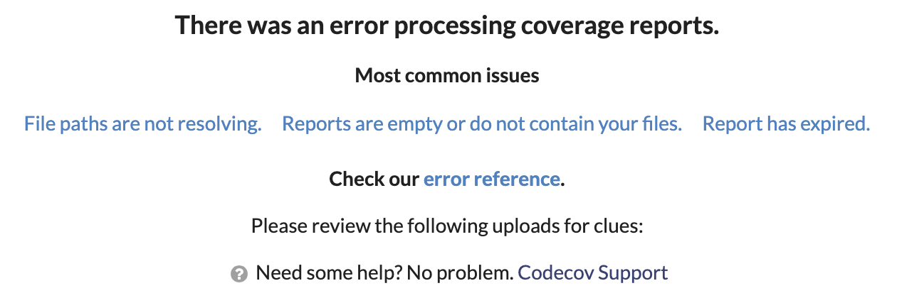
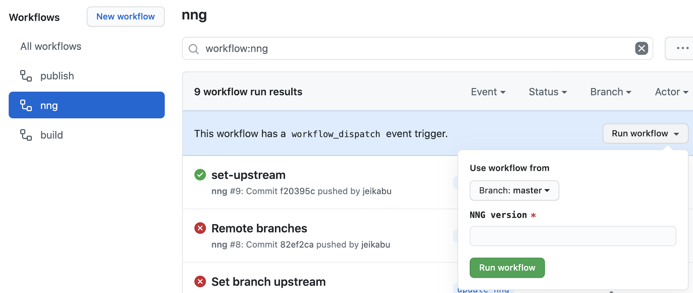
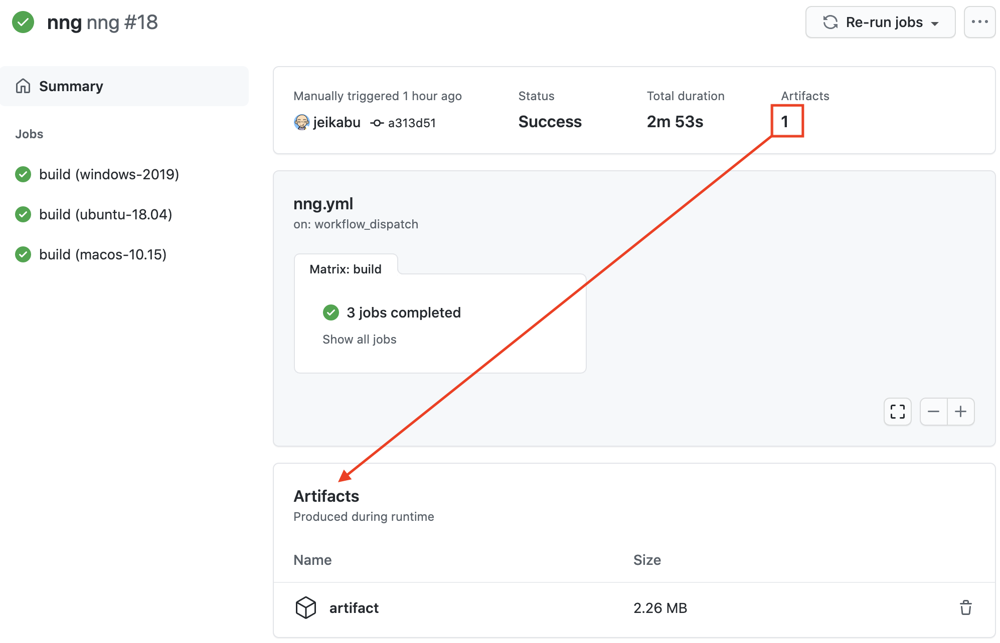

Over the years I've used a few different CI solutions for my humble public projects: 
[Travis](#Travis), [Appveyor](#Appveyor), and eventually Azure Pipelines.

I initially liked the idea of separating the CI/CD to avoid the dreaded vendor lock-in and freeing me to change SCC provider at will, but I've never really liked the UX of always having to visit an external site.  Github Actions is interesting for projects hosted on Github as it's an integrated solution similar to that offered by competitors like Gitlab.

Here I'm migrating one of my existing .NET projects to Github Actions, but only parts are .NET-specific and the majority should be equally applicable to other projects.

## Basics

In one of your repositories you can click the __Actions__ tab followed by the __Set up this workflow__ button to initialize a `.github/workflows/*.yml` file based on the contents of the repo.   Initial workflows come from templates in [Github's actions/starter-workflows](https://github.com/actions/starter-workflows) and look similar to [this workflow for .NET](https://github.com/actions/starter-workflows/blob/master/ci/dotnet-core.yml):

```yaml
name: .NET Core

# Trigger event
on:
  # Run on a push or pull request to default branch (usually master)
  push:
    branches: [ $default-branch ]
  pull_request:
    branches: [ $default-branch ]

# Jobs that run in parallel
jobs:
  build:

    runs-on: ubuntu-latest

    # Steps that run sequentially
    steps:
      # git checkout repo
    - uses: actions/checkout@v2
      # Install dotnet
    - name: Setup .NET Core
      uses: actions/setup-dotnet@v1
      with:
        dotnet-version: 3.1.101
      # Build and run tests
    - name: Build
      run: |
        dotnet restore
        dotnet build --configuration Release --no-restore
    - name: Test
      run: dotnet test --no-restore --verbosity normal
```

Workflows are triggered by events and run one or more _jobs_ in parallel.  Jobs are a set of sequential _steps_ that are either a shell script or an action.

[`on:`](https://docs.github.com/en/actions/reference/workflow-syntax-for-github-actions#on) specifies the events that trigger the workflow.  [Events can be anything](https://docs.github.com/en/actions/reference/events-that-trigger-workflows) from pushing with a git client, creating a release on Github, periodic timers, and more.

[`runs-on:`](https://docs.github.com/en/actions/reference/workflow-syntax-for-github-actions#jobsjob_idruns-on) specifies the virtual environment hosting the workflow runner (i.e. Windows, Linux, or MacOS).

[`uses:`](https://docs.github.com/en/actions/reference/workflow-syntax-for-github-actions#jobsjob_idstepsuses) specifies a reusable action (like [setup-dotnet](https://github.com/actions/setup-dotnet)) to take care of boilerplate steps common to CI/CD scripts.  These can be defined in: the same repo, public repos, or published docker images.

`with:` passes key-value parameters to actions.

[`run:`](https://docs.github.com/en/actions/reference/workflow-syntax-for-github-actions#jobsjob_idstepsrun) executes command-lines on the shell.  `run: |` (with a pipe) allows for multiple lines of commands.

Github provides an [introduction](https://docs.github.com/en/actions/learn-github-actions) and [syntax documentation](https://docs.github.com/en/actions/reference/workflow-syntax-for-github-actions).


## Multiple Platforms

One of the first changes I made was building and testing across multiple platforms:

```yaml
jobs:
  build:
    strategy:
      matrix:
        os: [windows-2019, ubuntu-18.04, macos-10.15]
    runs-on: ${{ matrix.os }}
    env:
      DOTNET_NOLOGO: true
      DOTNET_CLI_TELEMETRY_OPTOUT: true
      DOTNET_SKIP_FIRST_TIME_EXPERIENCE: true
    steps:
    # ...
    - name: Code coverage
      if: ${{ matrix.os }} == 'ubuntu-18.04'
      uses: codecov/codecov-action@v1
      # ...
```

[`strategy:` and `matrix:`](https://docs.github.com/en/actions/reference/workflow-syntax-for-github-actions#jobsjob_idstrategymatrix) enable you to create multiple jobs from a single definition.  Here setting each of "windows", "ubuntu", and "macos" values from `os:` to `${{ matrix.os }}` so `runs-on:` executes the job on all three OS's.  It can similarly be used to test against multiple runtimes/frameworks/compilers, debug/release/profile configurations, and so on.

[`env:`](https://docs.github.com/en/actions/reference/workflow-syntax-for-github-actions#jobsjob_idenv) sets environment variables in all steps of a job.

[`if:`](https://docs.github.com/en/actions/reference/workflow-syntax-for-github-actions#jobsjob_idstepsif) enables a job or step only under the condition specified by an [expression](https://docs.github.com/en/actions/reference/context-and-expression-syntax-for-github-actions
).  `${{ }}` is optional with `if:`, you can also write `if: matrix.os == 'xxx'`.

## Code Coverage

[I'd previously used](#code-coverage) [OpenCover](https://github.com/OpenCover/opencover) to instrument .NET projects.  [Microsoft has a nice article](https://docs.microsoft.com/en-us/dotnet/core/testing/unit-testing-code-coverage) detailing code coverage for .NET unit tests.  They use [Coverlet](https://dotnetfoundation.org/projects/coverlet) which seems to now be the de-facto .NET solution given that Xunit test projects created with `dotnet new xunit` automatically add a reference to [coverlet.collector](https://www.nuget.org/packages/coverlet.collector).

Coverlet has 3 different ways to profile projects.  The first approach integrates nicely by leveraging MSBuild ([docs](https://github.com/coverlet-coverage/coverlet/blob/master/Documentation/MSBuildIntegration.md)):
```sh
# Add package reference to coverlet.msbuild in test project
dotnet add tests/tests.csproj package coverlet.msbuild
# Run tests and generate `coverage.json`
dotnet test /p:CollectCoverage=true
```

The second approach uses a [global tool](https://github.com/coverlet-coverage/coverlet/blob/master/Documentation/GlobalTool.md):
```sh
# Install global tool
dotnet tool install --global coverlet.console
# Run tests
coverlet tests/bin/Debug/netcoreapp3.1/tests.dll --target dotnet --targetargs "test --no-build"
```

Make sure to include `--no-build` or the generated report will be empty.  According to [this blog](https://www.hanselman.com/blog/net-core-code-coverage-as-a-global-tool-with-coverlet) coverlet instruments the existing assembly, so you don't want `dotnet test` rebuilding and replacing it.

There's a third approach where you use a "DataCollector" (as shown in the MS article).  Coverlet provides information [comparing the approaches](https://github.com/coverlet-coverage/coverlet/blob/master/Documentation/DriversFeatures.md) as well as [related drawbacks](https://github.com/coverlet-coverage/coverlet/blob/master/Documentation/KnownIssues.md).

Now that you've got coverage data, you'll want to generate a report with something like [ReportGenerator](https://github.com/danielpalme/ReportGenerator), or a cloud solution like [Codecov](https://app.codecov.io/) as I will here.

Codecov provides [codecov-action](https://github.com/codecov/codecov-action) for easy integration with Github Actions:

```yaml
    steps:
    # ...
    - name: Test
      run: dotnet test --verbosity normal /p:CollectCoverage=true /p:CoverletOutputFormat=lcov
    - name: Code coverage
      if: matrix.os == 'ubuntu-18.04'
      uses: codecov/codecov-action@v1
      with:
        files: ./tests/coverage.info
        flags: unittests
```

If Codecov reports "an error processing coverage reports" you'll be left staring at the unhelpful:



In my case, despite [seemingly supporting json](https://docs.codecov.io/docs/supported-report-formats) (the default produced by Coverlet) Codecov was unable to process it.  Adding `/p:CoverletOutputFormat=lcov` to the test run fixed it.

Depending on the CI environment, testing framework, etc. codecov may be unable to process coverage reports without [path fixing](https://docs.codecov.io/docs/fixing-paths).  This among other configuration options can be placed in [`codecov.yml`](https://docs.codecov.io/docs/codecov-yaml) (which [can even be placed in `.github/`](https://docs.codecov.io/docs/codecov-yaml#can-i-name-the-file-codecovyml)).  See [codecov.yml reference](https://docs.codecov.io/docs/codecovyml-reference) for full details.

## Badges

Let's talk about [flair](https://www.google.com/search?q=office+space+flair).  Badges provide an easy way to keep an eye on your project:


[](https://codecov.io/gh/jeikabu/nng.NETCore)


The easiest way to get a build badge is open a workflow file or run and then click __··· > Create status badge__ to generate markdown similar to:
```

```

Check [the documentation](https://docs.github.com/en/actions/managing-workflow-runs/adding-a-workflow-status-badge) for specifics and additional options.

For Codecov, open the repository then __Settings > Badge__.  Alternatively, you can [generate the badge directly from Actions](https://itnext.io/github-actions-code-coverage-without-third-parties-f1299747064d).


## Native Code

I also want Actions to produce some platform-specific native binaries.  Even if you have no native code, this same approach can be used for multi-platform testing or to produce intermediary outputs/artifacts.

[As before](), we can use docker and QEmu on Linux to easily build platform-specific binaries without cross-compiling.
  The gist is create a Dockerfile like:
```dockerfile
# Start with Debian for arm32
FROM multiarch/debian-debootstrap:armhf-buster AS arm32v7

# Install required software
RUN apt-get update && apt-get install -y \
    build-essential \
    clang \
    cmake

RUN mkdir -p build && cd build \
    # Build arm32 binary 
    && cmake -G "Unix Makefiles" .. \
    && make \
    # Copy out of container to host
    && cp libnng.so /runtimes
```

Rather than muddle my declarative Actions workflow with lots of branching and platform-specific shenanigans, I like to move logic out into a stand-alone script.

`build_nng.ps1` takes care of these platform-specific details of building:
```powershell
if ($IsLinux) {
    # Register QEmu to handle unsupported binaries
    docker run --rm --privileged multiarch/qemu-user-static:register
    # Build our docker image
    docker build -t build-nng Dockerfile
    # Mount `/runtimes` and run image
    docker run -i -t --rm -v "$PWD/nng.NETCore/runtimes:/runtimes" build-nng
}
else {
    if ($is_windows) {
        cmake -A $arch -G "Visual Studio 16 2019" -DBUILD_SHARED_LIBS=ON -DNNG_TESTS=OFF -DNNG_TOOLS=OFF ..
        cmake --build . --config Release
        $dll = "Release/nng.dll"
    } else {
        cmake -G "Unix Makefiles" -DCMAKE_BUILD_TYPE=Release -DBUILD_SHARED_LIBS=ON -DNNG_TESTS=OFF -DNNG_TOOLS=OFF ..
        make -j2
        $dll = "libnng.dylib"
    }
    Copy-Item $dll "$runtimes/$path/native" -Force
}
```

Create another Github Action workflow:
```yaml
on:
  workflow_dispatch:
    inputs:
      nng_tag:
        description: 'NNG version'
        required: true
jobs:
  build:
    strategy:
      matrix:
        os: [windows-2019, ubuntu-18.04, macos-10.15]
    runs-on: ${{ matrix.os }}
    steps:
    - name: Checkout nng.NET
      uses: actions/checkout@v2
    - name: Build
      run: |
        ./scripts/build_nng.ps1 -nng_tag ${{ github.event.inputs.nng_tag }}
```

This workflow is triggered by the `workflow_dispatch` event with `inputs:` parameters that can be [manually run](https://docs.github.com/en/actions/managing-workflow-runs/manually-running-a-workflow) via Github UI:



`github.event` is part of the [context about the workflow run](https://docs.github.com/en/actions/reference/context-and-expression-syntax-for-github-actions#github-context).  Amongst other values it contains `nng_tag:` from triggering event.

`workflow_dispatch` can also be [triggered by HTTP](https://docs.github.com/en/rest/reference/actions#create-a-workflow-dispatch-event):
```sh
curl \
  -X POST \
  -H "Accept: application/vnd.github.v3+json" \
  https://api.github.com/repos/$USER/$REPO/actions/workflows/$WORKFLOW/dispatches \
  -d '{"inputs": {"nng_tag": "v1.3.0"}, "ref": "master"}' \
  # For authorization, must add one of:
  -u $USER:$TOKEN
  #OR
  -H "Authorization: Bearer $TOKEN"
  #OR
  -H "Authorization: Token $TOKEN"
```

The equivalent in powershell:
```powershell
$SECURE_TOKEN=ConvertTo-SecureString -String $TOKEN -AsPlainText
Invoke-WebRequest `
    -Method Post `
    -Headers @{accept= 'application/vnd.github.v3+json'} `
    -Uri https://api.github.com/repos/$USER/$REPO/actions/workflows/$WORKFLOW/dispatches `
    -Body (ConvertTo-Json @{inputs=@{nng_tag="v1.3.0"}; ref= "master"}) `
    # For authorization, must add one of:
    -Authentication OAuth -Token $SECURE_TOKEN
    # OR
    -Authentication Bearer -Token $SECURE_TOKEN
    # OR by replacing above `-Headers`
    -Headers @{authorization= "Token $TOKEN"; accept= 'application/vnd.github.v3+json'}
```

See ["Getting started with the REST API: Authentication"](https://docs.github.com/en/rest/guides/getting-started-with-the-rest-api#authentication) for more information and details on creating Github API tokens. It sounds like manual events should work even if the workflow isn't in the default branch, but [appears to have issues](https://github.community/t/how-to-trigger-repository-dispatch-event-for-non-default-branch/14470)

If there is an intermediary artifact that you want fed back into the project or build, `actions/checkout@v2` [makes it easy to work with git](https://github.com/actions/checkout#Push-a-commit-using-the-built-in-token):

```yaml
# ...
    steps:
      - run: |
          git config user.name ${{ username }}
          git config user.email ${{ email }}
          git add .
          git commit -m "generated"
          git push
```

After setting `user.name` and `user.email`, push the changes to a branch or do most anything else appropriate to your project.

You can also [attach build artifacts](https://docs.github.com/en/actions/guides/storing-workflow-data-as-artifacts) with [`actions/upload-artifact`](https://github.com/actions/upload-artifact):

```yaml
      - name: Archive artifacts
        uses: actions/upload-artifact@v2
        with:
        path: |
            nng.NETCore/runtimes/**/*
            !nng.NETCore/runtimes/any/**/*
        if-no-files-found: error
```



## Package and Publish

The final step is packaging and pushing a release to the nuget registry like we [used to do manually]().

Simplified script:
```powershell
param(
    [string]$Version,
    [string]$NugetApiKey,
    [string]$CertBase64,
    [string]$CertPassword
)

$ErrorActionPreference = "Stop"

# Strip the leading "v".  E.g. "v1.3.2-rc0" => "1.3.2-rc0"
$Version = $Version -replace "^v",""

# Build nupkg
dotnet pack --configuration Release -p:Version=$Version
# Get list of build nupkgs
$packages = Get-ChildItem "./bin/Release/*.nupkg"

# Download nuget.exe
$Nuget = "./nuget.exe"
Invoke-WebRequest https://dist.nuget.org/win-x86-commandline/latest/nuget.exe -OutFile $Nuget

# Create temporary code-signing certificate from base64-encoded string
$tempCert = New-TemporaryFile
[IO.File]::WriteAllBytes($tempCert.FullName, [Convert]::FromBase64String($CertBase64))

# Sign nupkg
foreach ($pkg in $packages) {
    & $Nuget sign $pkg -Timestamper http://sha256timestamp.ws.symantec.com/sha256/timestamp -CertificatePath $tempCert.FullName -CertificatePassword $CertPassword -Verbosity quiet
}

# Delete temporary code-signing certificate
$tempCert.Delete()

# Upload nupkg to nuget  
foreach ($pkg in $packages) {
    dotnet nuget push $pkg -k $NugetApiKey -s https://api.nuget.org/v3/index.json
}
```

There's a [few options to control .NET versioning](https://andrewlock.net/version-vs-versionsuffix-vs-packageversion-what-do-they-all-mean/).  I decided to set the entire version here at build time with `dotnet pack -p:Version=$Version`, but you could instead keep it in the project files under source control, only set the suffix with `dotnet build --version-suffix <VERSION_SUFFIX>`, or some combination of those.

To sign a package you [still need](https://github.com/NuGet/Home/issues/7939) nuget:
```powershell
nuget.exe sign <Nupkg> -Timestamper http://sha256timestamp.ws.symantec.com/sha256/timestamp -CertificatePath <CodeSigningCert>
```

To supply a code-signing certificate to Actions you can [base64 encode it](https://stackoverflow.com/questions/42592518) and treat it as one of the build secrets (as shown below).  That means we have to decode it to a temporary file before running nuget.

Additional resources related to .NET packaging/publishing:

- [Quickstart: Create and publish a NET Standard package (dotnet CLI)](https://docs.microsoft.com/en-us/nuget/quickstart/create-and-publish-a-package-using-the-dotnet-cli)
- [Create packages: Create a package (dotnet CLI)](https://docs.microsoft.com/en-us/nuget/create-packages/creating-a-package-dotnet-cli)
- [Create packages: Sign a package](https://docs.microsoft.com/en-us/nuget/create-packages/sign-a-package)
- [Publish packages: Publish a package](https://docs.microsoft.com/en-us/nuget/nuget-org/publish-a-package)

The packaging workflow:
```yaml
on:
  release:
    types: [published]
  workflow_dispatch:
    inputs:
        version:
          required: true

jobs:
  build:
    runs-on: windows-2019
    # ...
    - name: Package
      shell: pwsh
      run: |

        # Get the version
        $version = "${{ github.event_name }}" == "release" ? "${{ github.event.release.tag_name }}" : "${{ github.event.inputs.version }}"

        # Package and upload to nuget
        ./scripts/nupkg.ps1 -Version $version -CertBase64 ${{ secrets.CODE_SIGN_CERT_BASE64 }} -CertPassword ${{ secrets.CODE_SIGN_CERT_PASSWORD }} -NugetApiKey ${{ secrets.NUGET_API_KEY }}
```

Here I'm using [`on: release:`](https://docs.github.com/en/actions/reference/events-that-trigger-workflows#release) to trigger the workflow on Github releases; publish a release and the packages appear in nuget.

I want `$version` to come from either: the git tag associated with the release, or from the supplied `inputs.version` when manually dispatched.  We could use `if:` to provide alternative step implementations, but since it's just the value of one variable, it seems easier to resolve in script.

The `secrets` context provides access to values created in a Github repository with __Settings > Secrets > New repository secret__.  The idea is to [avoid storing sensitive information](https://docs.github.com/en/actions/reference/encrypted-secrets) (e.g. passwords) in public places, and Actions takes the extra step to scrub them from logs.

Instead of (or in addition to) pushing your package to a registry, you can also [upload it as a release asset](https://github.com/actions/upload-release-asset) attached to the release.

## Fin

I think that serves as a good start on my migration to Github Actions.  Really, I've barely scratched the surface as I've yet to look into community actions, writing my own custom actions, [self-hosted runners](https://docs.github.com/en/actions/hosting-your-own-runners), and much much more.